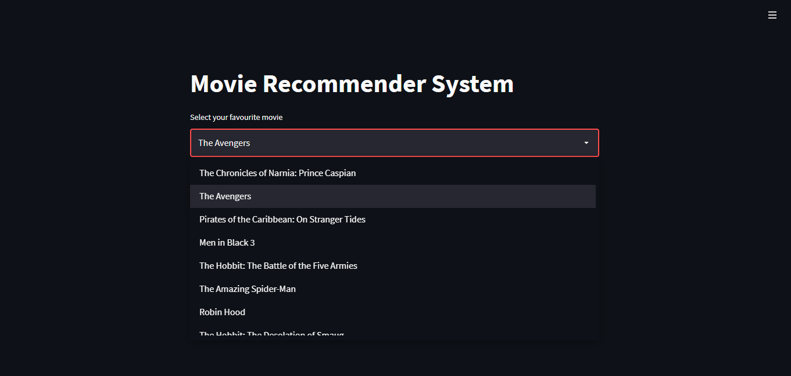
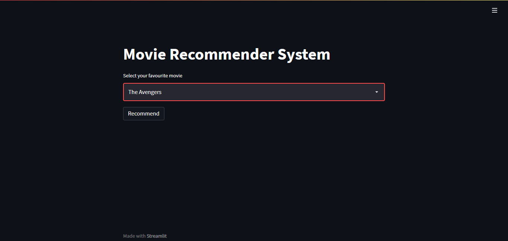
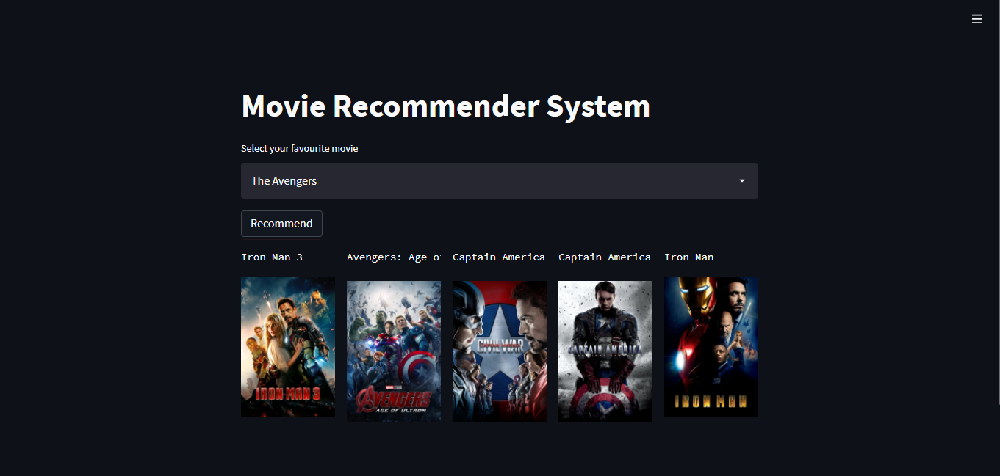

# Movie-Recommender-System
A web base recommender system that recommends movies to the user based on content similarity of movies selected by the users. A simple yet effective system where the
user will select a movie of his choice and will get recommendations of movies that are similar based on the content of the selected movie.

## Dataset:
The dataset is downloaded from **Kaggle:TMDB 5000 Movie Dataset**

Dataset Link: https://www.kaggle.com/tmdb/tmdb-movie-metadata

## Project Description:
The dataset has 5000 movies, by performing Vectorization technique movie vectors are created and then similarity between each movie vector is calculated using cosine similarity.
## Screenshot:
* The user will select a movie of choice from the dropdown menu.

* The selected movie will appear in the selection box

* Click on recommend button to get the recommendations of movies similar to the selected movie.

## Webapp Link:
Checkout the webapp by clicking the link below.

Link : https://movie-recommender-sytm.herokuapp.com/

## Technologies Used:
* Spyder is used for IDE.
* For creating webapp Streamlit framework is used.
* Heroku is used for Model Deployment.
